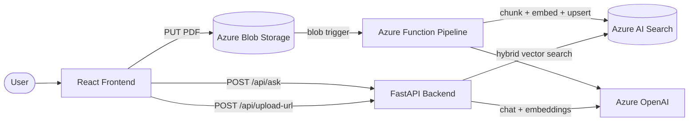

# Gram Sahayak (Village Helper)

**An AI-powered assistant that helps rural citizens understand government welfare schemes — built with Azure OpenAI, Azure AI Search, and RAG.**

Millions of people in rural India miss out on welfare benefits because scheme rules are buried in long, complex PDF documents written in official language. **Gram Sahayak** makes that information accessible: upload a scheme PDF, ask questions in plain language, and get simple answers in **English, Hindi, or Marathi**.

---

## Table of contents

- [Problem & solution](#problem--solution)
- [Features](#features)
- [Architecture](#architecture)
- [Tech stack](#tech-stack)
- [Repository structure](#repository-structure)
- [How it works](#how-it-works)
- [Prerequisites](#prerequisites)
- [Getting started](#getting-started)
- [API reference](#api-reference)
- [Deploy to Azure](#deploy-to-azure)
- [CI/CD with GitHub Actions](#cicd-with-github-actions)
- [Configuration](#configuration)
- [Adding more languages](#adding-more-languages)
- [Limitations & disclaimer](#limitations--disclaimer)
- [Further documentation](#further-documentation)

---

## Problem & solution

| Problem | How Gram Sahayak helps |
|---------|-------------------------|
| Dense official PDFs | Citizens cannot easily read or search long scheme circulars. |
| Language barrier | Documents are often in English or bureaucratic Hindi; users may prefer Hindi or Marathi. |
| Scattered information | Eligibility, documents, and deadlines are spread across many pages. |
| **Overall** | Upload PDFs → automatic indexing → chat answers grounded in those documents, in simple language. |

---

## Features

- **PDF ingestion pipeline** — Upload a scheme PDF; it is automatically chunked, embedded, and indexed.
- **Retrieval-Augmented Generation (RAG)** — Answers are grounded in uploaded documents, not free-form guessing.
- **Multilingual support** — Ask and receive answers in English, Hindi, or Marathi.
- **Smart retrieval** — Hybrid search (keyword + vector), query translation, and rank fusion for better recall.
- **Simple chat UI** — React + Tailwind interface with upload progress and language selection.
- **Azure-native MVP** — Designed for low-cost deployment on Azure Static Web Apps, App Service, Functions, AI Search, and Azure OpenAI.
- **Infrastructure as Code** — Optional Bicep templates under `infra/`.

---

## Architecture



**Data flow in plain terms:**

1. User uploads a PDF → browser gets a SAS URL from the backend → file lands in Blob Storage.
2. Azure Function triggers → extracts text → splits into chunks → creates embeddings → stores in Azure AI Search.
3. User asks a question → backend finds the best matching chunks → Azure OpenAI writes an answer using only that context.

---

## Tech stack

| Layer | Technology |
|-------|------------|
| Frontend | React, Vite, Tailwind CSS |
| Backend API | Python, FastAPI, Pydantic |
| Ingestion | Azure Functions, pdfplumber, LangChain text splitter |
| Vector store | Azure AI Search (hybrid + vector search) |
| AI | Azure OpenAI (chat + embeddings) |
| Storage | Azure Blob Storage |
| IaC | Azure Bicep |
| CI/CD | GitHub Actions |

---

## Repository structure

```text
gram-sahayak/
├── backend/                 # FastAPI RAG API
│   └── app/
│       ├── main.py          # HTTP routes (/health, /api/ask, /api/upload-url)
│       ├── rag_service.py   # Retrieval + answer generation
│       ├── upload_service.py# SAS URL generation for PDF uploads
│       ├── config.py        # Environment settings
│       └── schemas.py       # Request/response models
├── pipeline/                # Azure Functions PDF ingestion
│   ├── function_app.py      # Blob trigger entry point
│   └── shared/ingest.py     # Extract, chunk, embed, index
├── frontend/                # React chat + upload UI
│   └── src/
│       ├── App.jsx          # Main page, /api/ask calls
│       └── components/      # ChatWindow, UploadCard
├── scripts/
│   └── create_search_index.py  # One-time Azure AI Search index setup
├── infra/                   # Azure Bicep templates
├── docs/
│   └── RUNBOOK.md           # Detailed setup & deployment guide
├── .env.example             # Shared environment variable reference
└── package.json             # Root npm scripts
```

---

## How it works

### 1. Ingestion (`pipeline/`)

When a PDF is uploaded to the `incoming` blob container:

- Text is extracted with **pdfplumber**
- Content is split into overlapping chunks (~1400 characters)
- Chunks are embedded with **Azure OpenAI** (`text-embedding-ada-002`)
- Documents are upserted into **Azure AI Search** with metadata (`source_file`, `chunk_index`)

### 2. Question answering (`backend/`)

When a user submits a question:

- The query may be translated or rewritten into English for better retrieval (scheme PDFs are often in English)
- **Hybrid search** runs (keyword + vector), plus a vector-only fallback
- Results from multiple query variants are merged with **reciprocal rank fusion**
- Top chunks are sent to the chat model with strict rules: use only supplied context, explain simply, respond in the requested language

### 3. Frontend (`frontend/`)

- **`App.jsx`** — sends `{ query, language }` to `POST /api/ask` and displays the answer
- **`UploadCard.jsx`** — requests an upload URL from the backend, then uploads the PDF directly to Azure Blob Storage

---

## Prerequisites

### Azure resources

- **Azure OpenAI** with deployments for:
  - Chat (e.g. `gpt-4o-mini` or `gpt-35-turbo`)
  - Embeddings (`text-embedding-ada-002`)
- **Azure AI Search** (Basic tier or higher — supports vector search)
- **Azure Storage Account** with a blob container named `incoming`

### Local development tools

- Python **3.11+**
- Node.js **18+**
- [Azure Functions Core Tools](https://learn.microsoft.com/azure/azure-functions/functions-run-local) (optional, for local pipeline testing)
- [Azure CLI](https://learn.microsoft.com/cli/azure/install-azure-cli) (optional, for Bicep deployment)

---

## Getting started

### 1. Clone the repository

```bash
git clone https://github.com/<your-username>/gram-sahayak.git
cd gram-sahayak
```

### 2. Configure environment variables

Copy the example files and fill in your Azure credentials:

```bash
cp .env.example backend/.env
cp pipeline/local.settings.json.example pipeline/local.settings.json
cp frontend/.env.example frontend/.env
```

See [Configuration](#configuration) and `.env.example` for all required keys.

### 3. Install dependencies

```bash
# Python (backend + pipeline + scripts)
python -m venv .venv
source .venv/bin/activate          # Windows: .venv\Scripts\activate
pip install -r requirements.txt

# Node (frontend)
npm run install:all
```

### 4. Create the Azure AI Search index (one-time)

```bash
# Load env vars from backend/.env, then:
python scripts/create_search_index.py
```

This creates the index schema with searchable text fields and a vector field (`contentVector`, 1536 dimensions).

### 5. Start the services

**Terminal 1 — Backend**

```bash
npm run backend:dev
# or: cd backend && uvicorn app.main:app --reload --host 0.0.0.0 --port 8000
```

**Terminal 2 — Frontend**

```bash
npm run frontend:dev
# Opens at http://localhost:5173
```

**Terminal 3 — Pipeline (optional for local ingestion testing)**

```bash
cd pipeline
func start
```

### 6. Try it out

1. Open **http://localhost:5173**
2. Upload a government scheme PDF
3. Wait 1–3 minutes for indexing to complete
4. Ask a question (e.g. *"Who is eligible and what documents are required?"*)
5. Select your preferred response language

Health check: `GET http://localhost:8000/health`

---

## API reference

### `GET /health`

Returns `{ "status": "ok" }`.

### `POST /api/ask`

Ask a question against indexed scheme documents.

**Request body:**

```json
{
  "query": "What documents are required to apply?",
  "language": "Hindi"
}
```

**Response:**

```json
{
  "answer": "...",
  "sources": [
    {
      "id": "chunk-hash",
      "source_file": "scheme.pdf",
      "content": "relevant excerpt..."
    }
  ]
}
```

Supported `language` values: `English`, `Hindi`, `Marathi` (and common codes like `hi`, `mr`).

### `POST /api/upload-url`

Get a short-lived SAS URL so the browser can upload a PDF directly to Blob Storage.

**Request body:**

```json
{
  "filename": "pm-kisan-scheme.pdf",
  "content_type": "application/pdf"
}
```

**Response:**

```json
{
  "upload_url": "https://<account>.blob.core.windows.net/incoming/<blob>?<sas>",
  "blob_name": "<uuid>-pm-kisan-scheme.pdf",
  "expires_in_seconds": 900
}
```

---

## Deploy to Azure

Recommended Azure services (minimal-cost MVP):

| Component | Azure service |
|-----------|---------------|
| Frontend | Azure Static Web Apps (Free) |
| Backend | Azure App Service (Linux B1) |
| Pipeline | Azure Functions (Consumption) |
| Vector DB | Azure AI Search (Basic) |
| Storage | Azure Blob Storage (Standard LRS) |
| AI | Azure OpenAI |

### Option A: Bicep (recommended baseline)

```bash
az group create --name gram-sahayak-rg --location centralindia
az deployment group create \
  --resource-group gram-sahayak-rg \
  --template-file infra/main.bicep \
  --parameters @infra/main.parameters.json
```

Then create Azure OpenAI **deployments** in Azure OpenAI Studio (chat + embedding models).

See `infra/` and `docs/RUNBOOK.md` for full deployment steps.

### Option B: Manual (Azure Portal)

Create each resource manually and configure app settings from `.env.example`.

**After deployment:**

1. Run `scripts/create_search_index.py` against your production Search service
2. Set `VITE_API_BASE_URL` on Static Web Apps to your backend URL
3. Set `CORS_ORIGINS` on the backend to your frontend URL
4. Enable **Blob CORS** on the storage account for PUT uploads from your frontend domain

---

## CI/CD with GitHub Actions

Workflows under `.github/workflows/`:

| Workflow | Deploys |
|----------|---------|
| `frontend-staticwebapps.yml` | React app → Azure Static Web Apps |
| `backend-appservice.yml` | FastAPI → Azure App Service |
| `pipeline-functions.yml` | Ingestion function → Azure Functions |

### Required GitHub secrets

| Secret | Used by |
|--------|---------|
| `AZURE_STATIC_WEB_APPS_API_TOKEN` | Frontend |
| `AZURE_WEBAPP_NAME` | Backend |
| `AZURE_WEBAPP_PUBLISH_PROFILE` | Backend |
| `AZURE_FUNCTIONAPP_NAME` | Pipeline |
| `AZURE_FUNCTIONAPP_PUBLISH_PROFILE` | Pipeline |

Configure Azure App Service and Function App **application settings** using values from `.env.example`.

---

## Configuration

Key environment variables (full list in `.env.example`):

| Variable | Purpose |
|----------|---------|
| `AZURE_OPENAI_ENDPOINT` | Azure OpenAI resource URL |
| `AZURE_OPENAI_API_KEY` | Azure OpenAI API key |
| `AZURE_OPENAI_CHAT_DEPLOYMENT` | Chat model deployment name |
| `AZURE_OPENAI_EMBEDDING_DEPLOYMENT` | Embedding model deployment name |
| `AZURE_SEARCH_ENDPOINT` | Azure AI Search URL |
| `AZURE_SEARCH_API_KEY` | Search admin key |
| `AZURE_SEARCH_INDEX_NAME` | Index name (default: `gram-sahayak-index`) |
| `BLOB_STORAGE_CONNECTION_STRING` | Storage connection string |
| `BLOB_CONTAINER_NAME` | Upload container (default: `incoming`) |
| `CORS_ORIGINS` | Allowed frontend origins (backend only) |
| `VITE_API_BASE_URL` | Backend URL (frontend only) |
| `ENABLE_QUERY_TRANSLATION_FOR_RETRIEVAL` | Translate non-English queries for search |

**Where settings live:**

| Component | Local | Production |
|-----------|-------|------------|
| Backend | `backend/.env` | App Service → Configuration |
| Pipeline | `pipeline/local.settings.json` | Function App → Configuration |
| Frontend | `frontend/.env` | Static Web Apps → Environment variables |

> **Security:** Never commit `.env`, `local.settings.json`, or publish profiles. They are listed in `.gitignore`.

---

## Adding more languages

1. **Frontend** — add language names to `SUPPORTED_LANGUAGES` in `frontend/src/App.jsx`
2. **Backend** — in `backend/app/rag_service.py`:
   - Map the language in `answer()` (`normalized_language`)
   - Add it to the translation set in `_build_retrieval_plan()` so search works for non-English queries

Restart the backend and frontend after changes.

---

## Limitations & disclaimer

This is an **MVP** intended to demonstrate an end-to-end Azure RAG workflow.

- Answers depend entirely on **uploaded PDFs** — if a scheme is not indexed, the assistant cannot answer about it.
- AI responses should be **verified against official government sources** before making decisions.
- Production use would require content governance, accuracy review, audit logging, and legal disclaimers.
- Azure OpenAI access and model availability vary by region and subscription.

---

## Further documentation

- **[docs/RUNBOOK.md](docs/RUNBOOK.md)** — Step-by-step credentials, local run, and Azure deployment
- **[infra/](infra/)** — Bicep templates for provisioning Azure resources

---

## Contributing

Contributions are welcome. Please open an issue before large changes. For setup help, start with the runbook and ensure you can run all three components locally.

---

## License

Specify your license here (e.g. MIT). Add a `LICENSE` file if you plan to open-source the repository.

---

<p align="center">
  <strong>Gram Sahayak</strong> — making government welfare information understandable for every village.
</p>
